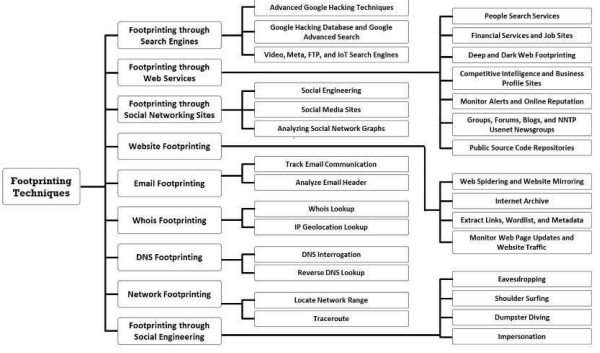

# Footprinting
Footprinting is the first step of any attack on information systems in which an attacker collects information
about a target network to identify various ways to intrude into the system

# Types of Footprinting
## Passive Footprinting
Passive footprinting involves gathering information about the target without direct
interaction. We can only collect archived and stored information about the target
using search engines, social networking sites, and so on.

## Active Footprinting
Active footprinting involves gathering information about the target with direct
interaction. Active footprintingrequires more preparation than passive footprinting, 
as it may leave traces that may alert
the target organization.

# Information Obtained in Footprinting
## Organization information
- Employee details
- Telephone numbers
- Branch and location details
- Background of the organization
- Web technologies'
- News articles, press releases, and related documents

## Network information
- Domain and sub-domains
- Network blocks
- Network topology, trusted routers, and firewalls
- IP addresses of the reachable systems
- Whois records
- DNS records

## Network information
- Domain and sub-domain
- Network blocks
- Network topology, trusted routers, and firewalls
- IP addresses of the reachable systems
- Whois records
- DNS records

# Footprinting Methodology
The footprinting methodology is a procedure for collecting information about a target
organization from all available sources. Attackers collect this information from publicly
accessible sources such as search engines, social networking sites, Whois databases, and so
on. The diagram given below illustrates.

